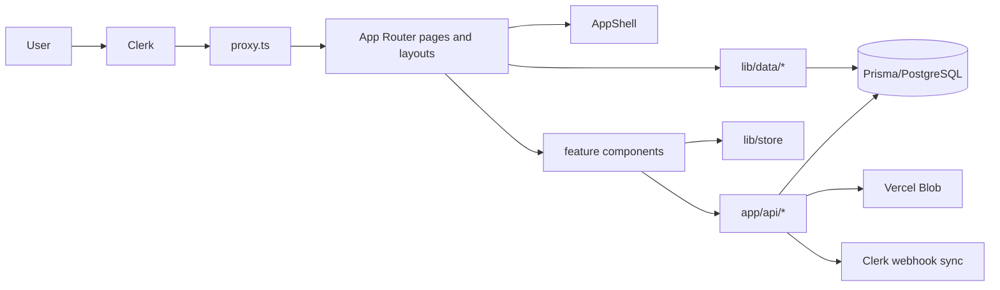

# Architecture

This document explains how the repository is structured today, how requests flow through the system, and which patterns are intentional versus accidental.

## High-Level Architecture

The application is a hybrid Next.js App Router system. Server components and server helpers fetch canonical data, route handlers own mutation boundaries, and Redux coordinates cross-component UI state and short-lived async state.

The app is not built around a single data layer abstraction. Instead, it uses a small number of explicit layers:

- App Router pages and layouts for composition
- `lib/data/*` for reusable server-side query and mapping logic
- `app/api/*` for request boundaries and client-consumable endpoints
- Redux slices for global UI and async coordination
- `components/common/*` for shared presentation primitives

## Frontend Architecture

The top-level shell is implemented in [components/common/app-shell.tsx](../components/common/app-shell.tsx) and mounted by [app/(main)/layout.tsx](../app/(main)/layout.tsx). The shell owns:

- global navigation
- breadcrumbs
- live clock display
- notification dropdown
- Clerk user controls
- the ambient background and layout framing

Feature screens are layered on top of that shell. Shared UI lives in `components/common`, while feature-specific modals and detail subcomponents stay under `components/projects`, `components/tradies`, and similar feature folders.

### Separation Of Concerns

The intended separation is:

- `app/` decides where things render
- `components/` decides how they look and how local interactions work
- `lib/data/` decides how Prisma data is queried and shaped
- `lib/store/` decides how cross-screen client state is coordinated
- `utils/` contains pure helpers that do not depend on feature state

That separation is mostly present in the live project and tradie flows. The older mock-driven screens still blur boundaries because `lib/mock-data.tsx` contains route registry data and presentation fixtures together.

## API Layer Structure

The route handler layer is split by concern rather than by database table.

- `app/api/(data)` contains the lookup and business-data endpoints consumed by client components
- `app/api/upload` handles Blob upload token generation and completion persistence
- `app/api/webhook` handles identity lifecycle events from Clerk
- `app/api/cron` exposes scheduled background jobs
- `app/api/graph` and `app/api/address` are separate integration surfaces

This gives the app four distinct request lifecycles:

1. read-only data lookup
2. authenticated mutation
3. external event ingestion
4. scheduled background processing

## How APIs Are Built And Consumed

The codebase uses two main backend shapes.

### 1. Server helper first

Reusable query modules such as [lib/data/projects.ts](../lib/data/projects.ts) and [lib/data/tradies.ts](../lib/data/tradies.ts) build Prisma queries, convert unsafe fields into serializable DTOs, and optionally wrap the result in `unstable_cache`.

This is the preferred shape for server-rendered data because it keeps the query logic close to the domain and avoids repeating mapping code.

### 2. Route handler first

Mutation routes such as [app/api/(data)/projects/route.ts](../app/api/(data)/projects/route.ts), [app/api/(data)/projects/[projectId]/updates/route.ts](../app/api/(data)/projects/%5BprojectId%5D/updates/route.ts), and [app/api/upload/route.ts](../app/api/upload/route.ts) validate request data, check auth, perform writes, and return JSON payloads that the client can consume immediately.

This shape is used when the request must cross a network boundary or when the client needs a direct fetch target.

## Data Flow Across The App

The canonical flow for the live modules is:

1. Clerk identifies the user.
2. The page or layout renders with the current auth state.
3. Server components load the initial project or tradie data through `lib/data/*`.
4. Client interactions dispatch Redux actions or thunks.
5. Mutation routes write to Prisma and revalidate cache tags.
6. The returned payload refreshes Redux state and the visible UI.

For the project module, [components/projects/project-detail-screen.tsx](../components/projects/project-detail-screen.tsx) then hydrates the current project into Redux so nested tabs, modals, and action panels can read a single active entity instead of each querying independently.

## Async Flow Architecture

The app uses `createAsyncThunk` in Redux for several flows:

- project creation, variation creation, and project updates in [lib/store/slices/projectsSlice.ts](../lib/store/slices/projectsSlice.ts)
- customer and site manager lookups in their dedicated slices
- tradie coordination dashboard loading, project lookup, and schedule mutations in [lib/store/slices/tradiesSlice.ts](../lib/store/slices/tradiesSlice.ts)

This is a deliberate choice. It keeps loading, error, and pending-state handling close to the relevant slice instead of spreading it across components.

The tradie slice adds its own short-lived dashboard cache keyed by query signature. That cache is local, explicit, and separate from Next cache tags.

## Fetching Strategies

The repository uses three distinct fetch styles.

### Server fetch

Server data helpers in `lib/data` query Prisma directly. They are used when the initial render can be server-side and when the result needs structured relation data.

### Client fetch via thunks

Redux thunks call `fetch()` or `fetchJson()` for interactive flows that need mutation feedback or list refreshes.

### Client fetch via component effect

[components/projects/projects-client.tsx](../components/projects/projects-client.tsx) still performs a debounced client-side fetch for project list updates. That is functional, but it is an inconsistency because the rest of the app already prefers slice-owned async flows.

## Utility Functions Around API Handling

There are two important utility categories.

- [utils/fetch.ts](../utils/fetch.ts) handles JSON response parsing and fallback error messaging
- [lib/utils/apply-variation-delay.ts](../lib/utils/apply-variation-delay.ts) contains domain logic that belongs with the variation workflow rather than in the route handler itself

That split is healthy. Network handling stays thin while business rules stay testable and reusable.

## Error Handling Standards

There is no single error envelope yet.

The current conventions are:

- route handlers return plain text or JSON with an `error` field
- client thunks convert failures to strings with `rejectWithValue` or by throwing `Error`
- server helpers log with `console.error` and rethrow when the failure should bubble up

This is workable, but it makes cross-layer reuse harder because callers must know which error style a route returns.

## Validation Strategy

Validation is primarily imperative and close to the request boundary.

- route handlers check required fields and parse numbers or dates before writes
- Prisma schema constraints enforce shape and relationship integrity
- runtime guards are used for enum-like query parameters

Zod is available in the dependency tree, but the inspected live paths do not yet use a shared schema layer for API validation.

## Authentication And Authorization Flow

Clerk is used for authentication and metadata sync.

The intended auth stack is:

- middleware blocks unauthenticated access
- `auth()` checks guard sensitive server work
- Clerk webhooks create or update local users
- metadata updates keep role and application identity aligned

There is a critical mismatch between intent and implementation:

- [proxy.ts](../proxy.ts) currently treats `/(.*)` as public
- several data endpoints under `app/api/(data)` are readable without explicit auth checks
- mutation routes are more defensive than lookup routes

So the architecture is auth-aware, but not uniformly auth-enforced.

Important production note: API routes are intended to be private. Authentication and request gating are implemented via the global middleware in `proxy.ts` (Clerk middleware). In this codebase the middleware is the primary enforcement boundary and route handlers should assume requests are authenticated unless they are explicitly public endpoints (webhooks, static assets, health checks, etc.).

Recommended immediate actions:

- Restrict the middleware public-route matcher to only true public routes (sign-in, sign-up, webhook, static assets, health). Do not include a catch-all like `/(.*)`.
- Require explicit server-side `auth()` checks in any mutation route that performs writes or sensitive reads. Middleware is necessary but not always sufficient; server-side guards prove intent and are resilient to future middleware changes.
- Validate request bodies at the route boundary (use Zod or shared validators) and return a consistent JSON error envelope for client consumption.
- Add automated tests or a small integration check that exercises the most-sensitive routes and verifies they return 401/403 when unauthenticated.

## Server Actions, API Routes, And Backend Integration Patterns

The repository does not rely on broad client-side server actions. Instead, it uses a mix of server helpers and route handlers:

- server helpers for reusable query composition
- route handlers for network requests and external integration
- database writes wrapped in small, domain-specific functions
- cache invalidation via `revalidateTag`

This is why project creation, variation approval, and update posting all return the refreshed project payload. The UI depends on nested relations, so the server sends a full updated entity instead of a partial patch.

## Reusable Abstractions And Helper Utilities

The most important abstractions currently in the codebase are:

- [components/common/app-shell.tsx](../components/common/app-shell.tsx) for global chrome
- [components/common/section-card.tsx](../components/common/section-card.tsx) for consistent panel structure
- [components/common/metric-card.tsx](../components/common/metric-card.tsx) for KPI surfaces
- [components/common/data-table.tsx](../components/common/data-table.tsx) for generic tables
- [components/common/status-pill.tsx](../components/common/status-pill.tsx) for status badges
- [lib/data/projects.ts](../lib/data/projects.ts) and [lib/data/tradies.ts](../lib/data/tradies.ts) for server data access
- [lib/store/slices/projectsSlice.ts](../lib/store/slices/projectsSlice.ts) and [lib/store/slices/tradiesSlice.ts](../lib/store/slices/tradiesSlice.ts) for client coordination

## Performance Considerations

The codebase already uses a number of sensible performance tactics:

- server-side data helpers with `unstable_cache`
- cache tags on the `projects` and `milestones` domains
- pagination for lookup collections
- de-duplication when appending paged lookup items
- debounced client fetches for project list search
- query-level pagination and lookup limits to avoid overfetching

The cost is that the system now has three caching concepts in play at once: Next cache tags, client-side Redux caches, and component-local state. This is workable today, but it is a refactor target.

## Existing Architectural Patterns And Why They Are Used

| Pattern | Why it exists |
| --- | --- |
| Server helpers in `lib/data` | Reuse Prisma query logic and hide serialization details |
| Route handlers for mutations | Keep auth, validation, and request handling close together |
| Redux for coordination state | Share filters, active entities, uploads, and modal state across components |
| Cache tags and `unstable_cache` | Reduce repeated Prisma work for server-rendered screens and lookup lists |
| Refreshed entity payloads after writes | Keep nested project and tradie screens in sync without manual patching |

## Anti-Patterns Present Today

The main issues are not design-level; they are boundary and consistency issues:

- `proxy.ts` makes the middleware effectively public because of the current matcher
- some GET data endpoints expose data without auth checks
- `serializableCheck` is disabled globally in the Redux store
- `lib/mock-data.tsx` still mixes route metadata with mock content
- `components/projects/projects-client.tsx` bypasses Redux thunks for list fetching
- `app/globals.css` contains a feature-specific leads block that does not match the shared design language

## Areas That Need Refactoring

1. Tighten route protection and make the auth story uniform.
2. Standardize data-fetching entry points so client code does not mix direct fetches and thunk-owned fetches in the same feature.
3. Split mock registry data from runtime navigation data.
4. Consolidate repeated pagination and lookup logic.
5. Reduce the amount of feature-specific styling in the global stylesheet.
