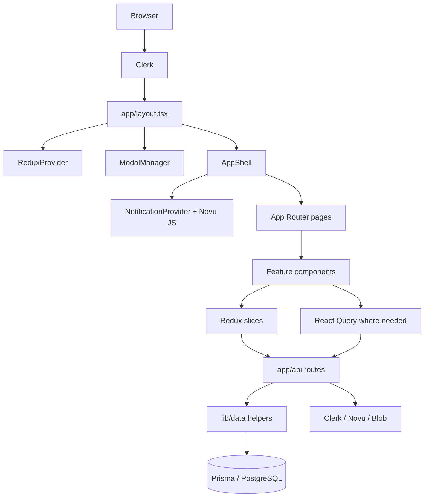
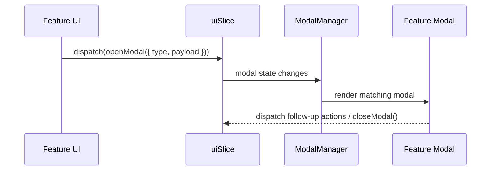
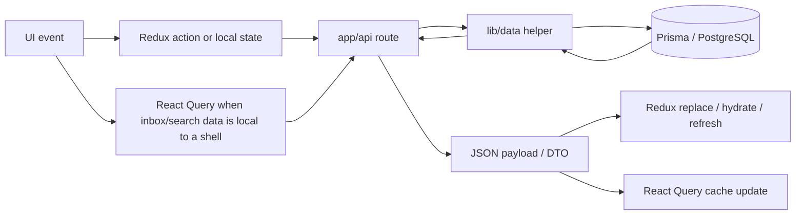

# Current Implementation

This is a live architecture report for the repository as implemented today. It is intentionally specific to the actual files, helpers, and flows in the codebase.

## Snapshot

The application is a construction-management portal built with Next.js App Router, Clerk authentication, Prisma, Redux Toolkit, React Query, Novu, and Vercel Blob. The product has a split personality: some modules are fully live and data-backed, while a few legacy surfaces still rely on mock-driven composition.

Live surfaces currently center on projects, tradies, leads, quotations, chat-based offer generation, file uploads, Clerk sync, and notification delivery.

## Top-Level Structure

## Frontend Architecture

### Application Structure

- `app/` owns routing, layouts, and route handlers.
- `components/` owns rendering, interaction, and feature composition.
- `lib/data/` owns Prisma queries, write helpers, and server-side DTO mapping.
- `lib/store/` owns Redux state and async coordination.
- `utils/` owns pure helpers, validators, and client fetch helpers.

The root layout mounts [ReduxProvider](../components/providers/redux-provider.tsx), [ModalManager](../components/modals/modal-manager.tsx), and the global toaster. The authenticated shell is mounted from [app/(main)/layout.tsx](../app/(main)/layout.tsx) through [components/common/app-shell.tsx](../components/common/app-shell.tsx).

### State Management

Redux is the shared client coordination layer. The store in [lib/store/index.ts](../lib/store/index.ts) registers `customers`, `projects`, `siteManagers`, `tradies`, `quotes`, and `ui` slices.

- `ui` stores the active modal and screen filters.
- `projects` stores the active project, optimistic updates, mutation state, upload state, and per-project detail UI.
- `tradies` stores coordination filters, paging, selection, caching, and lookup state.
- `quotes`, `customers`, and `siteManagers` support their own feature coordination.

React Query is used where the state is local to a shell or provider and benefits from caching and subscription semantics.

- [context/NotificationContext.tsx](../context/NotificationContext.tsx) uses `useQuery` and `useQueryClient` for Novu inbox data.
- [components/common/app-shell.tsx](../components/common/app-shell.tsx) mounts a `QueryClientProvider` around notifications.
- [app/(main)/leads/page.tsx](../app/(main)/leads/page.tsx) mounts a local `QueryClientProvider` for the leads screen.

### Modal Architecture

The shared modal architecture is centralized through `uiSlice.modal` and [components/modals/modal-manager.tsx](../components/modals/modal-manager.tsx).

The manager maps modal `type` values to actual feature modals such as project creation, variation creation, tradie scheduling, project detail, picture preview, milestone actions, and quotation offer-file creation.

The current codebase still has a few feature-local modal shells in older screens, but the shared standard for cross-feature modals is the centralized manager.

### Notification Architecture

The shell renders the notification button and inbox popover through [components/common/notifications.tsx](../components/common/notifications.tsx) and [components/notification/notification-item.tsx](../components/notification/notification-item.tsx).

The provider in [context/NotificationContext.tsx](../context/NotificationContext.tsx) uses the Novu JS client to:

- list notifications for the signed-in Clerk user
- mark a notification as read
- mark all unread notifications as read
- archive a notification
- subscribe to real-time notification events and update the React Query cache

### Shared Component Structure

- `components/common/` contains cross-feature primitives such as the app shell, notifications popover, upload dropzone, cards, tables, and shells.
- `components/<feature>/` contains feature-specific composition and modals.
- `components/ui/` contains the low-level UI primitives.

### Context Providers

Current provider wiring is:

- [app/layout.tsx](../app/layout.tsx): `ClerkProvider`, `ReduxProvider`, `Toaster`, `ModalManager`
- [components/common/app-shell.tsx](../components/common/app-shell.tsx): `QueryClientProvider`, `NotificationProvider`, `TooltipProvider`
- [components/offer/offer-client.tsx](../components/offer/offer-client.tsx): `ChatProvider`

## Backend Architecture

### API Route Patterns

Route handlers live under `app/api/*` and act as the request boundary. The current pattern is:

1. Parse request input.
2. Validate at the boundary.
3. Check auth when the route is protected.
4. Call `lib/data/*` helpers or integration helpers.
5. Return a consistent response shape where shared response helpers are used.

The repository includes both standardized helpers in [utils/validators/response.ts](../utils/validators/response.ts) and a few legacy routes that still use ad hoc `NextResponse.json(...)` or `Response` return values.

### Validation Flow

Shared Zod validators live under `utils/validators/`.

- `common.ts` provides shared pagination, query, and coercion validators.
- `lead.ts` provides lead create/update/search schemas.
- `projects.ts` provides lookup and response-shape schemas.
- `files.ts` provides upload metadata and token payload schemas.
- `material.ts`, `milestone.ts`, `user.ts`, and `notification.ts` provide feature-specific validation and payload typing.

Route-level validation is already used in key flows such as file uploads, webhook handling, and notification payload generation.

### Response Handling Flow

The shared response helper layer in [utils/validators/response.ts](../utils/validators/response.ts) provides:

- success responses
- paginated responses
- validation error responses
- generic error responses
- unauthorized, forbidden, not-found, bad-request, and conflict helpers

It also includes request parsing helpers for bodies, search params, and route params. Some newer route code uses these helpers directly; older routes still return `NextResponse.json(...)` inline.

### Database Interaction Patterns

The repository uses Prisma directly in `lib/data/*` helpers.

Common patterns:

- use `Promise.all` for independent reads
- convert Prisma decimals to strings before returning DTOs
- use `include` to return canonical records with nested relations
- use Prisma transactions when multiple writes must stay consistent
- revalidate cache tags after writes

Examples include `createChatMessages()` and `updateChatMessages()` in [lib/data/chat.ts](../lib/data/chat.ts), which use transactions or bulk writes plus `revalidateTag`.

### Authentication Flow

Clerk is the authentication provider.

Current flows:

- the root layout wraps the app in `ClerkProvider`
- the main app shell reads `auth()` server-side to determine signed-in state
- mutation routes check auth before writes where that route has been updated to do so
- the Clerk webhook synchronizes identity lifecycle events into the local database

### Authorization Flow

Authorization is not fully uniform across every route, but the intended model is clear:

- protect mutations at the request boundary
- use server-side auth checks for state-changing routes
- keep public routes explicit
- use route- and role-aware checks for sensitive operations

## Shared Utilities

### API Helpers

- [utils/fetch.ts](../utils/fetch.ts): shared client helper that unwraps JSON responses and throws readable errors.
- [utils/validators/response.ts](../utils/validators/response.ts): shared API response builder and request-parsing helpers.

### Validation Helpers

- [utils/validators/common.ts](../utils/validators/common.ts): pagination, coercion, dates, strings, and common enum helpers.
- [utils/validators/lead.ts](../utils/validators/lead.ts): lead schemas and normalization.
- [utils/validators/projects.ts](../utils/validators/projects.ts): lookup and response schemas.
- [utils/validators/files.ts](../utils/validators/files.ts): upload metadata and token validation.
- [utils/validators/material.ts](../utils/validators/material.ts)
- [utils/validators/milestone.ts](../utils/validators/milestone.ts)
- [utils/validators/notification.ts](../utils/validators/notification.ts)
- [utils/validators/user.ts](../utils/validators/user.ts)

### Response Helpers

- [utils/validators/response.ts](../utils/validators/response.ts)
- Standard error responses and success envelopes
- Validation treeification through Zod
- Legacy helpers kept for compatibility during migration

### Notification Helpers

- [types/notification.ts](../types/notification.ts): notification type union, schema-derived data map, and template builder.
- [lib/notification/novu.ts](../lib/notification/novu.ts): Novu server trigger helper that resolves subscriber ids and dispatches workflows.

### Modal Helpers

- [lib/store/slices/uiSlice.ts](../lib/store/slices/uiSlice.ts): modal state, filters, and modal actions.
- [components/modals/modal-manager.tsx](../components/modals/modal-manager.tsx): modal router and renderer.

## Data Flow

The current implementation uses three client-state channels:

1. Local component state for UI-only interaction.
2. Redux for shared coordination and cross-page state.
3. React Query for cached data subscriptions such as notifications.

For live data, the preferred pattern is:

1. fetch from a route handler or `lib/data` helper
2. persist through Prisma
3. revalidate the relevant tag
4. return the refreshed canonical record
5. update Redux or React Query from the returned payload

## Business Workflows

### Projects

The project workflow is the most complete data-backed module.

- `lib/data/projects.ts` provides list, lookup, detail, and KPI queries.
- Project mutations live in `lib/data/projectsWrite.ts`, `lib/data/projectUpdates.ts`, `lib/data/variations.ts`, `lib/data/tradieSchedules.ts`, and related routes.
- Detail screens hydrate Redux with canonical project payloads and keep the active project in sync with returned data.

### Tradies

The tradie module centers on scheduling and operational coordination.

- `lib/data/tradies.ts` provides tradie lists and dashboard data.
- Redux stores filters, paging, selections, pending states, replacement flags, and cached dashboard payloads.
- The coordination flows return refreshed data rather than patching nested fields manually.

### Leads

Lead data powers the offer workflow and several notification triggers.

- `lib/data/leads.ts` handles CRUD, analytics, and notification dispatch.
- `useLeadSearch()` uses `fetchJson()` for debounced lookup requests.
- Lead creation and updates trigger Novu notifications through `createNotification()` and `triggerNotification()`.

### Uploads

The upload flow uses Vercel Blob direct uploads in [app/api/upload/route.ts](../app/api/upload/route.ts).

- the user must be authenticated before token generation
- the client sends validated file metadata
- upload completion persists file records through [lib/data/file.ts](../lib/data/file.ts)
- uploads are constrained by MIME type and size validators

### Auth, Identity, And Sync

[app/api/webhook/clerk/route.ts](../app/api/webhook/clerk/route.ts) keeps Prisma aligned with Clerk lifecycle changes.

- `user.created` inserts a local user and may create a matching customer row.
- `user.updated` syncs profile edits and role changes.
- `user.deleted` deletes the local user row.
- `organizationInvitation.accepted` updates role metadata.

### Quotations

Quotations are backed by Prisma helpers in [lib/data/quotes.ts](../lib/data/quotes.ts).

- list and KPI helpers are cached with cache tags
- quote creation stores decimal values in Prisma and returns serialized values
- the quotation UI can open the offer-file modal from Redux

## Offer And Chat Architecture

The offer workflow is built around the chat route and a client-side context/provider pair.

- [app/api/chat/route.ts](../app/api/chat/route.ts) streams agent responses.
- [context/ChatContext.tsx](../context/ChatContext.tsx) owns the AI chat session, message transport, line items, and offer file state.
- [components/offer/offer-client.tsx](../components/offer/offer-client.tsx) composes the chat and offer canvas.
- [components/offer/offer-chat.tsx](../components/offer/offer-chat.tsx) renders the message stream.
- [components/offer/offer-file.tsx](../components/offer/offer-file.tsx) renders the offer preview, files tab, and line-item tab.
- [components/offer/file-template.tsx](../components/offer/file-template.tsx) renders the customer-facing offer HTML in an iframe.

The chat route uses the following tools:

- `lineItemTool`
- `offerFileTool`
- `fetchLeadInfoTool`
- `fetchLeadFilesTool`
- `FileProcessingTool`

The UI currently has a specialized renderer for the first four named tools, with generic fallback rendering for unknown tool parts.

## Performance And Caching

The codebase already uses several sensible performance tactics:

- `unstable_cache` and cache tags in server helpers
- pagination for lookup collections
- de-duplication when appending paged lookup items
- debounced client fetches for search-driven lookups
- parallel reads for independent aggregates

The current system uses multiple caching layers at once: Next cache tags, Redux state, React Query caches, and local component state. That is workable today, but it should be kept intentional.

## Current Limitations And Inconsistencies

- Some legacy routes still return ad hoc response shapes instead of the shared helper envelope.
- Some screens still mount local modal state instead of using the global modal manager.
- The route-matcher/auth story should be checked in `proxy.ts` before any new protected route work.
- The screen registry in [lib/mock-data.tsx](../lib/mock-data.tsx) still mixes routing, mock data, and legacy surface definitions.

## Implementation Notes For Future Work

- Keep live business flows returning refreshed canonical payloads instead of partial patches when nested relations matter.
- Prefer `lib/data/*` for reusable Prisma logic and route handlers for request-specific auth and validation.
- Treat Redux as coordination state, not as a database cache.
- Keep serializable DTOs at the client boundary, especially where Prisma decimals or nested relations are involved.

