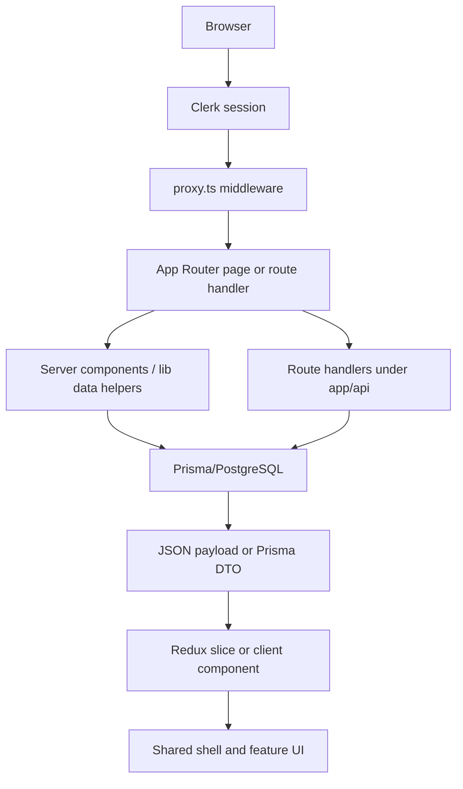

# Current Implementation

This document is a live report of what is implemented today. It is intentionally specific to the repository, including the current architecture, feature surface, integration points, and the parts of the system that still need cleanup.

## Snapshot

The application is a construction management portal built with Next.js App Router, Clerk authentication, Prisma on PostgreSQL, Redux Toolkit, and Vercel Blob. The product is split between live operational surfaces and legacy mock-driven screens. The live paths are centered on projects, tradies, file uploads, Clerk sync, and reminder automation.

At the moment the app includes:

- a shared application shell with navigation, breadcrumb, notifications, and account controls
- Clerk sign-in, sign-up, and profile routes
- project list, project detail, project mutation, and upload workflows backed by Prisma
- tradie coordination dashboards, schedule updates, and reminder jobs
- Clerk webhook synchronization into local user and customer records
- a route-driven screen registry that still powers several mock module surfaces

## What Is Actually Live

| Area | Current state | Key files |
| --- | --- | --- |
| Shell and navigation | Live | [app/(main)/layout.tsx](../app/(main)/layout.tsx), [components/common/app-shell.tsx](../components/common/app-shell.tsx) |
| Project list and detail | Live and data-backed | [lib/data/projects.ts](../lib/data/projects.ts), [components/projects/project-detail-screen.tsx](../components/projects/project-detail-screen.tsx) |
| Tradie coordination | Live and data-backed | [lib/data/tradies.ts](../lib/data/tradies.ts), [lib/store/slices/tradiesSlice.ts](../lib/store/slices/tradiesSlice.ts) |
| Uploads | Live | [app/api/upload/route.ts](../app/api/upload/route.ts), [lib/data/file.ts](../lib/data/file.ts) |
| Identity sync | Live | [app/api/webhook/clerk/route.ts](../app/api/webhook/clerk/route.ts), [lib/auth.ts](../lib/auth.ts), [lib/data/user.ts](../lib/data/user.ts) |
| Reminder automation | Live | [app/api/cron/tradie-reminders/route.ts](../app/api/cron/tradie-reminders/route.ts), [lib/jobs/tradie-reminder.ts](../lib/jobs/tradie-reminder.ts) |
| Legacy module screens | Still mostly mock-driven | [lib/mock-data.tsx](../lib/mock-data.tsx) |

## Routing And Entry Points

The home route in [app/page.tsx](../app/page.tsx) renders the dashboard experience directly and passes the Clerk signed-in state into the dashboard component.

The main route group in [app/(main)/layout.tsx](../app/(main)/layout.tsx) wraps authenticated surfaces in [components/common/app-shell.tsx](../components/common/app-shell.tsx). That shell is responsible for global chrome rather than feature logic.

The app still uses a screen registry in [lib/mock-data.tsx](../lib/mock-data.tsx) to map route slugs to module renderers. That registry is now a mix of legacy mock screens and live implementations. The important consequence is that routing is still centralized even though data sources now vary by screen.

Authentication pages are mounted under:

- [app/sign-in/[[...sign-in]]/page.tsx](../app/sign-in/%5B%5B...sign-in%5D%5D/page.tsx)
- [app/sign-up/[[...sign-up]]/page.tsx](../app/sign-up/%5B%5B...sign-up%5D%5D/page.tsx)
- [app/user-profile/page.tsx](../app/user-profile/page.tsx)

## Request And Rendering Model

The server-side model is split into two layers:

1. Pages and layouts render the initial UI, often with server-side auth checks.
2. Route handlers or `lib/data/*` helpers perform the actual database queries and mutations.

That separation is deliberate. It allows server components to read live data directly while client components can still use route-based mutations and Redux state for interactivity.

## Frontend Architecture

The top-level shell is implemented in [components/common/app-shell.tsx](../components/common/app-shell.tsx) and mounted by [app/(main)/layout.tsx](../app/(main)/layout.tsx). The shell owns:

- global navigation
- breadcrumbs
- live clock display
- notification dropdown
- Clerk user controls
- the ambient background and layout framing

Feature composition is mostly layered like this:

- `app/` defines routes and route groups
- `components/common/` holds cross-feature surfaces such as cards, status pills, and data tables
- `components/<feature>/` holds feature-specific screens, modals, and detail subcomponents
- `components/ui/` contains the low-level shadcn-style primitives
- `lib/store/` coordinates cross-screen client state

The current codebase is not purely server-driven or purely client-driven. It is a hybrid:

- server components and `lib/data/*` fetch the canonical project and tradie data
- client components manage screen interactivity, filters, selection, dialogs, and optimistic overlays
- Redux is used only where state must survive across subcomponents or flows

## API Layer And Data Access

The main data access pattern is server helper first, route handler second.

- `lib/data/projects.ts` builds Prisma queries, maps decimal fields to strings, and exposes cached helpers through `unstable_cache`
- `lib/data/tradies.ts` does the same for tradie lists, schedules, and dashboard aggregates
- `app/api/(data)/*` routes mostly call those helpers or mirror their logic for client requests
- mutation routes return refreshed entity payloads so the UI can update immediately without building client-side normalization logic

This pattern is visible in the project workflow. A mutation such as project creation or variation approval updates the database, revalidates the `projects` tag, and returns a full refreshed `ProjectDetail` payload. Redux then replaces the list item and active detail state with the returned entity instead of trying to patch nested fields manually.

### Fetching strategies

There is no single data-fetching abstraction yet.

- server pages use direct helper calls such as `getProjectById()` and `getCachedProjects()`
- Redux slices use `createAsyncThunk` plus the native `fetch()` API or `fetchJson()` wrapper
- some client components, such as the project list, still perform local debounced fetches instead of dispatching a slice thunk
- lookup collections such as customers, site managers, and project lookups use paginated append behavior with de-duplication by id

`fetchJson()` in [utils/fetch.ts](../utils/fetch.ts) is the only shared client request helper. It expects JSON responses and translates `{ error: string }` bodies into thrown errors with a fallback message.

### Error Handling

The repository currently uses pragmatic, route-local error handling rather than a global envelope:

- route handlers return `Response` or `NextResponse` with short error messages
- client thunks catch and rethrow readable error strings
- low-level helpers log to `console.error` when a database or Clerk operation fails
- upload completion and webhook handlers fail closed when the expected identity or user record is missing

This works, but it is inconsistent. Some routes return plain strings, some return JSON `{ error }`, and some client code expects one style while other code expects the other.

### Validation Strategy

Validation is mostly imperative today.

- route handlers validate required fields manually before database writes
- IDs, query params, and enum-like strings are checked with simple runtime guards
- Prisma schema constraints provide the final structural safety net

The repo already depends on Zod and React Hook Form, but those tools are not yet used as a project-wide validation contract in the inspected code paths.

## Authentication And Authorization

Clerk is the only authentication provider in the repository.

The intended flow is:

1. middleware gates access
2. server components call `auth()` when they need the signed-in state
3. mutation routes check `userId` before writing
4. webhooks update local user records and mirror metadata back into Clerk

That intent is partially implemented, but there is a material mismatch in [proxy.ts](../proxy.ts). The public route matcher currently includes `/(.*)`, which makes the middleware effectively public for all routes. In practice, protection is therefore applied inconsistently and several GET endpoints remain publicly readable.

This needs to be treated as a real security issue, not just a style concern.

## Server Actions, API Routes, And Backend Integration

The repository uses `use server` modules under `lib/data/*` for query composition and `app/api/*` route handlers for network-visible integration.

The model is:

- `lib/data/*` = reusable server-side query and mapping logic
- `app/api/*` = request boundary, validation, auth, and response formatting
- Prisma = persistence layer
- Clerk + Blob + cron = external integrations

The most important backend integrations are:

- Clerk webhook sync in [app/api/webhook/clerk/route.ts](../app/api/webhook/clerk/route.ts)
- Blob upload token generation and post-upload persistence in [app/api/upload/route.ts](../app/api/upload/route.ts)
- tradie reminder automation in [app/api/cron/tradie-reminders/route.ts](../app/api/cron/tradie-reminders/route.ts)
- variation delay logic in [lib/utils/apply-variation-delay.ts](../lib/utils/apply-variation-delay.ts)

## Business Workflows

### Projects

The project workflow is the most complete live module.

- [lib/data/projects.ts](../lib/data/projects.ts) provides list, lookup, detail, and KPI queries
- [app/api/(data)/projects/route.ts](../app/api/(data)/projects/route.ts) supports list and lookup modes
- [app/api/(data)/projects/[projectId]/route.ts](../app/api/(data)/projects/%5BprojectId%5D/route.ts) returns the full detail payload
- [app/api/(data)/projects/[projectId]/updates/route.ts](../app/api/(data)/projects/%5BprojectId%5D/updates/route.ts) creates updates, uploads photos, and marks photo-required milestones complete
- [app/api/(data)/projects/[projectId]/variations/route.ts](../app/api/(data)/projects/%5BprojectId%5D/variations/route.ts) creates variations
- [app/api/(data)/projects/[projectId]/variations/[variationId]/route.ts](../app/api/(data)/projects/%5BprojectId%5D/variations/%5BvariationId%5D/route.ts) approves or rejects variations and applies schedule delay logic

The detail page is not a stub. [components/projects/project-detail-screen.tsx](../components/projects/project-detail-screen.tsx) hydrates Redux with the project payload, restores local detail UI state, and cleans up when the component unmounts.

### Tradies

The tradie module centers on scheduling and operational coordination.

- [lib/data/tradies.ts](../lib/data/tradies.ts) returns tradies, schedules, and dashboard aggregates
- [app/api/(data)/tradie-schedules/route.ts](../app/api/(data)/tradie-schedules/route.ts) creates schedules and serves coordination data
- [app/api/(data)/tradie-schedules/[scheduleId]/route.ts](../app/api/(data)/tradie-schedules/%5BscheduleId%5D/route.ts) updates schedule status and flags replacement requirements
- [lib/jobs/tradie-reminder.ts](../lib/jobs/tradie-reminder.ts) sends reminder state and advances pending schedules to pending response

Redux carries a meaningful amount of tradie coordination state, including filters, pagination, selection, replacement flags, and a local 30-second dashboard cache.

### Auth, Identity, And Sync

The Clerk webhook in [app/api/webhook/clerk/route.ts](../app/api/webhook/clerk/route.ts) keeps Prisma aligned with identity lifecycle changes.

- `user.created` inserts a local user and, for customers, creates a matching customer row
- `user.updated` syncs profile edits and role changes
- `user.deleted` deletes the local user row
- `organizationInvitation.accepted` updates role metadata

The helper in [lib/auth.ts](../lib/auth.ts) then mirrors role and customer metadata back to Clerk.

### Uploads

The upload flow in [app/api/upload/route.ts](../app/api/upload/route.ts) uses Vercel Blob direct uploads.

The current behavior is:

- the user must be authenticated before a token can be generated
- the client sends a payload with file name, project id, optional milestone id, and an optional stable file id
- the route allows common image, document, spreadsheet, and text formats
- uploads are capped at 40 MB
- completion saves a `File` row through [lib/data/file.ts](../lib/data/file.ts)

### Reminders And Background Jobs

[lib/jobs/tradie-reminder.ts](../lib/jobs/tradie-reminder.ts) finds schedules due exactly seven days out, skips already-reminded rows, marks eligible schedules as pending response, and writes a reminder timestamp. The cron route only exposes that job behind a bearer secret.

The job is intentionally simple. It does not send email itself; it mutates schedule state and logs reminder activity.

## Performance And Caching

The codebase already uses a number of sensible performance tactics:

- server-side data helpers with `unstable_cache`
- cache tags on the `projects` and `milestones` domains
- pagination for lookup collections
- de-duplication when appending paged lookup items
- debounced client fetches for project list search
- query-level pagination and lookup limits to avoid overfetching

The cost is that the system now has three caching concepts in play at once: Next cache tags, client-side Redux caches, and component-local state. This is workable today, but it is a refactor target.

## Current Limitations And Inconsistencies

The biggest implementation gaps today are:

- [proxy.ts](../proxy.ts) currently marks nearly everything public because the matcher includes `/(.*)`
- several GET data endpoints under `app/api/(data)` do not check auth at all
- `lib/mock-data.tsx` still mixes route registry, dashboard mock data, and design constants
- the project list fetch path in [components/projects/projects-client.tsx](../components/projects/projects-client.tsx) bypasses a Redux thunk and fetches directly from the client
- customer and site manager lookup slices duplicate almost the same pagination code
- [app/globals.css](../app/globals.css) contains a large leads-specific CSS block with its own token system and font choice, which sits outside the shared design system

## Recommended Refactor Targets

1. Fix the Clerk matcher and align route-level authorization with the intended security model.
2. Split `lib/mock-data.tsx` into separate navigation, screen registry, and mock-content modules.
3. Normalize the API response envelope so JSON errors and success payloads are consistent.
4. Consolidate lookup pagination into one helper or shared thunk pattern.
5. Move the large leads CSS block into a feature-scoped stylesheet or rebuild it with the shared tokens.

## Implementation Notes For Future Work

- Keep live business flows returning refreshed entity payloads instead of partial patches when the UI depends on nested relations.
- Prefer server helpers in `lib/data/*` for reusable Prisma queries and route handlers for request-specific auth and validation.
- Treat Redux as coordination state, not as a replacement for the database.
- Keep serializable DTOs at the client boundary, especially where Prisma decimals or nested relations are involved.

