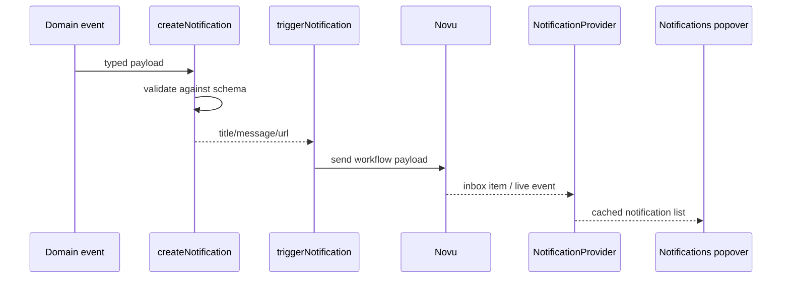

# Notification Handler

This document describes the notification system as implemented today: payload generation, Novu dispatch, Novu inbox rendering, and user interaction in the UI.

## Overview

The notification system delivers operational updates to users through Novu. It is used for lead events, project creation and updates, tradie scheduling updates, and variation updates.

## Architecture

```mermaid
flowchart TD
  Event[Business event] --> Builder[createNotification()] 
  Builder --> Trigger[triggerNotification()]
  Trigger --> NovuServer[Novu API]
  NovuServer --> Inbox[Novu JS inbox]
  Inbox --> Context[NotificationProvider]
  Context --> Query[React Query cache]
  Query --> UI[Notifications popover]
```

### Novu Integration

The repository uses both Novu server and client SDKs:

- [lib/notification/novu.ts](../lib/notification/novu.ts) uses `@novu/api` to trigger workflows from the server.
- [context/NotificationContext.tsx](../context/NotificationContext.tsx) uses `@novu/js` to load inbox notifications for the signed-in Clerk user.

### Notification Context

`NotificationProvider` owns the inbox client state. It:

- instantiates the Novu JS client for the current Clerk user
- fetches the notification list with React Query
- subscribes to notification create/read/archive events
- updates the React Query cache in response to live events
- exposes read/archive actions to the UI

### Notification UI

- [components/common/notifications.tsx](../components/common/notifications.tsx) renders the popover button, inbox tabs, refresh action, and bulk mark-read action.
- [components/notification/notification-item.tsx](../components/notification/notification-item.tsx) renders one notification card with read/archive controls and navigation.
- [components/notification/util-components.tsx](../components/notification/util-components.tsx) provides the unread dot, loading state, and empty state.

### Notification Rendering

Notifications are displayed in a popover with:

- unread indicator on the bell button
- All / Unread tab filter
- mark-all-read action
- refresh action
- per-item mark-read and archive actions
- optional primary navigation link from the notification payload

### Notification Generation

Business events create payloads with `createNotification()` and then dispatch them with `triggerNotification()`.

Event sources currently include:

- [lib/data/leads.ts](../lib/data/leads.ts)
- [lib/data/projectsWrite.ts](../lib/data/projectsWrite.ts)
- [lib/data/projectUpdates.ts](../lib/data/projectUpdates.ts)
- [lib/data/variations.ts](../lib/data/variations.ts)
- [lib/data/tradieSchedules.ts](../lib/data/tradieSchedules.ts)

## Source of Truth

The notification payload source of truth is split across three layers:

1. [utils/validators/notification.ts](../utils/validators/notification.ts) defines the payload schemas.
2. [types/notification.ts](../types/notification.ts) maps those schemas to typed payload data and templates.
3. [lib/notification/novu.ts](../lib/notification/novu.ts) dispatches the final subject/body/url payload to Novu.

This keeps payload creation consistent: the templates are derived from validated schema types, and the actual dispatch payload is always shaped the same way.

## Notification Lifecycle

1. A business event occurs, such as a lead being created or a tradie schedule being updated.
2. The feature helper calls `createNotification(...)` with a typed payload.
3. The payload is validated by the matching Zod schema.
4. The template builder creates a title, message, and URL.
5. `triggerNotification(...)` resolves subscribers and sends the payload to Novu.
6. Novu stores and delivers the notification.
7. `NotificationProvider` reads and caches inbox notifications for the current user.
8. The popover renders the notification list and user actions.



## File Structure

- [utils/validators/notification.ts](../utils/validators/notification.ts): Zod schemas for every notification payload type.
- [types/notification.ts](../types/notification.ts): payload typing and template mapping.
- [lib/notification/novu.ts](../lib/notification/novu.ts): Novu workflow dispatch helper.
- [context/NotificationContext.tsx](../context/NotificationContext.tsx): client provider and live inbox state.
- [components/common/notifications.tsx](../components/common/notifications.tsx): popover inbox UI.
- [components/notification/notification-item.tsx](../components/notification/notification-item.tsx): row/card renderer.
- [components/notification/util-components.tsx](../components/notification/util-components.tsx): empty/loading/unread helpers.

## Notification Types

### `leadCreated`

- Purpose: announce that a new lead was created.
- Payload: `leadId`, `leadType`, `budget`, `location`, `customerName`, `customerEmail`, `customerPhone`.
- Trigger source: lead creation in [lib/data/leads.ts](../lib/data/leads.ts).
- UI behavior: opens the leads area with a search query for the customer name.

### `leadUpdated`

- Purpose: announce that a lead moved state.
- Payload: `leadId`, `leadType`, `location`, `customerName`, `customerEmail`, `customerPhone`, `status`.
- Trigger source: lead update path in [lib/data/leads.ts](../lib/data/leads.ts).
- UI behavior: opens the leads area filtered by status.

### `leadAssigned`

- Purpose: announce that a lead was assigned to someone.
- Payload: `leadId`, `leadType`, `location`, `customerName`, `customerEmail`, `customerPhone`, `assignedTo`.
- Trigger source: lead update path in [lib/data/leads.ts](../lib/data/leads.ts).
- UI behavior: opens the leads area with a search query for the customer name.

### `projectCreated`

- Purpose: announce that a project was created.
- Payload: `projectId`, `projectName`, `projectType`, `location`, `customerName`, `customerEmail`, `customerPhone`.
- Trigger source: [lib/data/projectsWrite.ts](../lib/data/projectsWrite.ts).
- UI behavior: opens the project detail route.

### `projectSiteUpdates`

- Purpose: announce a new site update on a project.
- Payload: `projectId`, `projectName`, `milestoneName`, `updateNote`.
- Trigger source: [lib/data/projectUpdates.ts](../lib/data/projectUpdates.ts).
- UI behavior: opens the project updates tab.

### `tradieScheduleCreated`

- Purpose: announce that a tradie has been scheduled.
- Payload: `projectId`, `projectName`, `milestoneName`, `tradieName`, `tradieTrade`, `tradieCompany`, `scheduleDate`.
- Trigger source: [lib/data/tradieSchedules.ts](../lib/data/tradieSchedules.ts).
- UI behavior: opens the project milestones tab.

### `tradieScheduleUpdated`

- Purpose: announce that a tradie schedule changed status.
- Payload: `projectId`, `projectName`, `milestoneName`, `tradieName`, `tradieTrade`, `tradieCompany`, `scheduleDate`, `status`.
- Trigger source: [lib/data/tradieSchedules.ts](../lib/data/tradieSchedules.ts).
- UI behavior: opens the project milestones tab.

### `variationCreated`

- Purpose: announce that a variation was created.
- Payload: `projectId`, `projectName`, `variationDescription`, `variationAmount`.
- Trigger source: [lib/data/variations.ts](../lib/data/variations.ts).
- UI behavior: opens the project variations tab.

### `variationUpdated`

- Purpose: announce that a variation changed status.
- Payload: `projectId`, `projectName`, `variationDescription`, `variationAmount`, `status`.
- Trigger source: [lib/data/variations.ts](../lib/data/variations.ts).
- UI behavior: opens the project variations tab.

## Extending Notifications

1. Add a new schema in [utils/validators/notification.ts](../utils/validators/notification.ts).
2. Add the new type to the `notificationSchemas` map and the derived `NotificationType` union.
3. Add a template function in [types/notification.ts](../types/notification.ts).
4. Trigger the notification from the relevant business helper via [lib/notification/novu.ts](../lib/notification/novu.ts).
5. Update the UI copy or navigation target if the new type should open a different page.
6. If the Novu workflow changes, update the workflow id or subscriber resolution logic in the server trigger helper.

## UI Flow

1. The bell button in the app shell shows an unread dot when unread notifications exist.
2. The user opens the popover and sees all non-archived notifications by default.
3. The user can switch between All and Unread tabs.
4. The user can mark one item as read, mark all as read, or archive an item.
5. Clicking the notification link marks the item read and navigates to the payload URL.
6. Real-time Novu events update the React Query cache without requiring a full refresh.

## Best Practices

- Keep payload generation in the schema/template layer, not in the UI.
- Validate notification payloads before triggering Novu.
- Keep titles, bodies, and URLs consistent across event sources.
- Reuse `createNotification()` rather than constructing ad hoc notification payloads.
- Keep the notification UI generic; use the payload URL for navigation rather than per-type custom UI when possible.