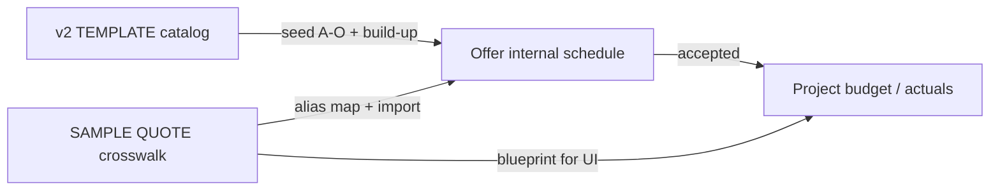
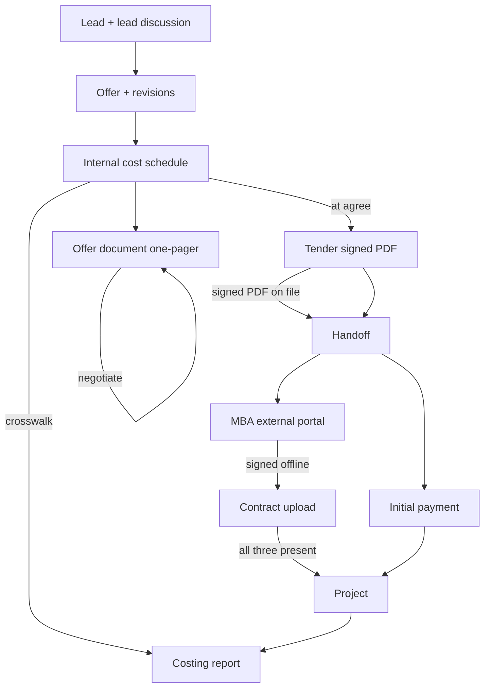
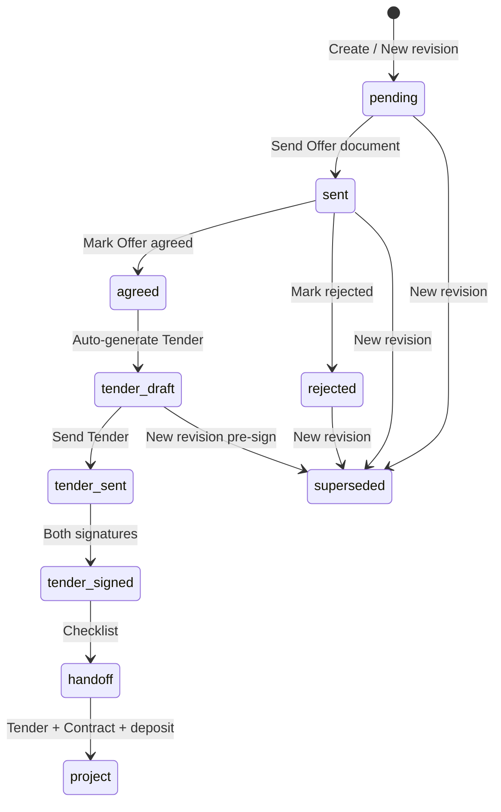

# Offer Design (Implementation Spec)

Domain language lives in [`CONTEXT.md`](../../CONTEXT.md). This document turns locked decisions into build guidance.

**Source templates** (in `docs/offer/`):

| File | Role in design |
|------|----------------|
| `Royal Constructions QUOTE TEMPLATE v2.xlsx` | **Canonical Offer catalog** — A–O stages, SETTINGS, build-up, margin analysis, COVER |
| `Royal Constructions TENDER TEMPLATE v3 (NCC 2025).docx` | **Canonical Tender** — customer inclusions + acceptance |
| `SAMPLE QUOTE.xlsx` | **Operational crosswalk + execution blueprint** — flat trade list, quote vs actual, area calcs (see below) |

---

## SAMPLE QUOTE.xlsx (operational workbook)

Royal Construction uses this file **during execution**, not only at quote time. It is **not** a filled copy of v2 — it is a parallel structure that should inform import/export and the post-acceptance budget view.

### Sheet comparison

| v2 template | SAMPLE QUOTE | Purpose |
|-------------|--------------|---------|
| `COVER` | `SAMPLE QUOTE` (header + totals) | Job metadata + rolled-up budget |
| `QUOTE` (A–O staged lines) | `SAMPLE QUOTE` col D (flat ~69 trade rows) | Cost lines |
| — | `costing report` | Granular vendor lines, **Quote / Actual / Difference**, invoice no, GST columns |
| `COVER` building size | `area ` | m² calculators (slab, frame, bricks, tiles) |
| `SETTINGS` + `MARGIN ANALYSIS` | Footer on `SAMPLE QUOTE` (Royal Construction Fee 20%, HWI, licence, admin, labour) | Mark-up (simpler chain than v2) |
| `ALLOWANCES` | Optional lines (pool, landscaping, fence, PC items, etc.) | Scope flags |

### What SAMPLE adds beyond v2

1. **Quote vs actual** — budget column (H) vs spend (I) vs variance (J); persists through construction.
2. **Invoice tracking** — `costing report` columns: invoice no, comments, trade, ex-GST / inc-GST.
3. **Flat trade list** — names match how RC procures subs (e.g. `PLUMBER`, `GYPROCK / BULKHEAD`) rather than A–O section headers.
4. **Extra optional lines** — pool, landscaping, fence, Bunnings misc, temp camera, Samsung locks, granny flat, etc.
5. **Area calculators** — derive slab/frame/brick/tile quantities from GF/FF/porch/garage m².

### Design incorporation (recommended)



| Phase | Use v2 | Use SAMPLE |
|-------|--------|------------|
| **Offer v1** (build now) | Primary data model: stages A–O, SETTINGS build-up, margin analysis, COVER fields | **Crosswalk table**: flat trade name ↔ stage + cost line; **Excel import** for jobs already in SAMPLE format; agent synonyms |
| **Offer export (transition)** | Native app export | Optional **legacy SAMPLE xlsx** export so estimators can keep working in Excel |
| **Project v1.5+** (after accept) | Stage subtotals → milestone budgets | **costing report** pattern: quote budget per line, actual spend, variance, invoices |
| **Pricing helpers** | SETTINGS defaults | **`area` sheet** logic as optional calculator (feeds quantities into cost lines) |

### Canonical build-up (decision)

- **Offer contract value** in app: replicate **v2** chain (direct cost → HBCF → admin → PM → contingency → margin → GST 10%).
- **SAMPLE footer** (20% fee on direct sum + HWI + licence + admin + labour): treat as **legacy Excel rollup** for import/export mapping, not the source of truth for Tender pricing.
- On import from SAMPLE, map footer lines into v2 SETTINGS/overhead rows where possible; flag unmapped lines for estimator review.

### Crosswalk catalog (implement once)

Maintain `docs/offer/catalog-crosswalk.json` (or DB seed) with rows like:

- `sampleTaskName`, `templateStage`, `templateLineItem`, `optional` (pool, landscaping, …)
- Used for: Excel import, agent tool labels, inclusion–cost linking hints

Seed from diff of v2 `QUOTE` leaf rows vs SAMPLE `SAMPLE QUOTE` col D + extra `costing report` rows.

### v1 scope impact

**Add to v1 (lightweight):**

- Document crosswalk; seed alias map from SAMPLE task names
- Design `CostLine` with optional `legacySampleKey` for import
- Agent prompts list SAMPLE trade names as synonyms

**Defer (Project phase):**

- Full quote vs actual UI and invoice columns (SAMPLE `costing report`)
- `area` calculator UI (can start as read-only helper or agent tool)
- Legacy SAMPLE xlsx export

**Do not replace v2 with SAMPLE for Offer structure** — v2 aligns with Tender build-up and margin analysis; SAMPLE is the operational/evolution format RC uses after the workbook is “live” on a job.

---

## Architecture (locked)



---

## Documents by phase (locked)

| Phase | Builder-only | Customer-facing |
|-------|--------------|-----------------|
| **Offer** | Full A–O schedule, build-up, margin, inclusion–cost linking | **Offer document** — one-pager (bullets + total) |
| **Tender** | Frozen internal schedule | **Tender** — Word v3, auto-generated at **Offer agreed** |
| **Handoff** | Three checklist items on Offer | Signed Tender PDF; MBA Contract upload; initial payment |
| **Contract** | — | **MBA Contract** — filled/signed off-system; **upload** signed PDF |
| **Project** | **Costing report** (SAMPLE pattern) | — |

---

## Lifecycle (locked)



| Transition | Rule |
|------------|------|
| Internal costing | Always runs during Offer; never on client one-pager |
| Send Offer document | Sets **sent**; revisions until **agreed** |
| Mark Offer agreed | Freezes snapshot; **auto-generates Tender** from internal data |
| Tender | Estimator reviews before **tender_sent** |
| New revision | Allowed until **tender_signed**; then **Variations** on Project |
| After tender_signed | Upload signed Tender PDF; MBA contract via external portal + upload; record **initial payment** |
| Create Project | Requires **all three**: signed Tender PDF, uploaded Contract PDF, initial payment recorded |
| Initial payment | Flexible amount; org default + per-Offer override; admin override optional |
| Costing report | Seeded at Project create from internal lines via SAMPLE crosswalk |

---

## Entity model (locked)

- **Offer** — handoff checklist: signed Tender PDF, uploaded MBA Contract, initial payment
- **Project** — after signed Tender + uploaded MBA Contract; owns **Costing report**
- **Contract** — upload only; MBA portal is **external** (out of scope to integrate v1)

---

## Two documents per Offer (superseded section)

See **Documents by phase** above. During negotiation the client sees the **one-pager** only; **Tender** is issued after **Offer agreed**.

---

## References

- Single base ref: `RC-Q-2026-001`
- Revisions: `RC-Q-2026-001-R2` (first revision: no suffix or `-R1`)
- Same ref on internal export, Tender PDF, and list UI

---

## Chat model

| Thread | Scope | On new revision |
|--------|-------|-----------------|
| Lead discussion | Per Lead | Unchanged; injected as **agent context only** (v1 UI) |
| Offer chat | Per Offer revision | **New thread** |

Implement: `LeadDiscussion` (or lead-scoped session) + `OfferChat` linked to `offerId`. `/api/chat` loads lead discussion + files into system context; client renders Offer chat only.

---

## Internal cost schedule (v1 data)

### Cost stages (seed from template)

A — General Requirements · B — Site Preparation · C — Footings & Slab · D — Frame & Roof · E — External Envelope · F — Plumbing · G — Electrical · H — HVAC · I — Internal Linings · J — Waterproofing & Tiling · K — Kitchen, Bath & Joinery · L — PC Items & Fixtures · M — Painting · N — External Works · O — Completion & Handover

### Cost line fields

- `stageCode` (A–O)
- `item`, `trade`, `notes`
- `costExGst`
- Optional `dwellingLabel` for multi-dwelling notes

### Contract build-up (replicate Excel)

```
directCost = sum(stage subtotals)
+ hbcf + admin + pm + contingency → costBase
+ builderMargin → subtotalExGst
+ gst (10%) → contractValueIncGst
```

**Offer pricing settings:** org defaults; per-Offer overrides on internal tab only.

**Margin analysis:** mirror `MARGIN ANALYSIS` sheet (target / minimum / status).

### Allowances

Seed PC caps + exclusion list from `ALLOWANCES` sheet; editable per Offer.

---

## Tender (v1 data)

### Inclusion items

Seed numbered items from Word template (Sections 1–2+). Fields:

- `section`, `number`, `title`, `description`
- `status`: Included | Excluded | By Owner | Included with provisions | Not Applicable
- `statusOverridden` (boolean)

### Inclusion ↔ cost mapping

Seed **catalog template** mapping inclusion items → cost stages/lines. Compute linked default status; estimator may override without changing cost lines.

### Customer metadata

From Excel COVER + Word header: client, site, lot, build type, drawing ref, validity, areas (m²), optional offer price rows.

---

## Persistence (Prisma direction)

Rename over time: `Quote` → `Offer`, `QuoteItem` → `CostLine`.

Suggested additions:

- `Offer`: `reference`, `revisionSuffix`, `leadId`, `status`, `contractValueIncGst`, pricing settings JSON, `rejectedReason`, `sentAt`, `acceptedAt`, `active`
- `CostLine`: stage, trade, amounts, `offerId`
- `InclusionItem`: tender fields, `offerId`, mapping keys, override flag
- `OfferChatSession`: `offerId`
- `InitialPayment`: `offerId`, amount, recordedAt, recordedBy
- `File`: signed Tender, exports

Legacy `QuoteItem.item` field must align with cost line schema before save works.

---

## Agent tools (evolve from current)

| Current | Target |
|---------|--------|
| `lineItemTool` | Write **cost lines** (stage A–O, trade, cost ex-GST) |
| `offerFileTool` | Update Tender sections + optional offer price rows; never stream margin |
| — | Read lead discussion + files in prompt (not Offer chat UI) |

Fix: `ChatContext` switch fall-through; sync cost lines from tool stream; GST 10% not 18%; no double-count GST on save.

---

## UI (v1)

| Surface | Content |
|---------|---------|
| Offer list | All Offers; filter by status; show ref + revision |
| Offer workspace | Offer chat · internal grid (QUOTE) · Tender preview · margin · allowances |
| Actions | Download Tender · Send · Mark sent · Mark accepted/rejected · Record deposit · New revision · Create Project |

Auto-save while `pending`. Read-only when sent / accepted / rejected / superseded.

---

## v1 scope

**In**

- Offer → Tender full flow (internal costing, one-pager, auto-Tender, sign + upload)
- Handoff: signed Tender PDF + MBA Contract upload + initial payment (all three)
- Create Project when checklist complete; seed **Costing report**
- Admin override on deposit if incomplete
- SAMPLE crosswalk, revisions until tender_signed

**Out / external**

- MBA portal integration (staff use portal manually)
- In-app MBA contract generation
- Pricing Model, client portal, area calculator UI

---

## Migration from current code

1. Fix save schema + GST math
2. Introduce Offer/CostLine models (or extend Quote)
3. Split chat: lead vs offer
4. Replace iframe template with Tender sections + internal grid
5. Rename routes/copy Quote → Offer over time

See also [`quote-offer-agent.md`](../quote-offer-agent.md) for current agent wiring (update as this spec lands).
