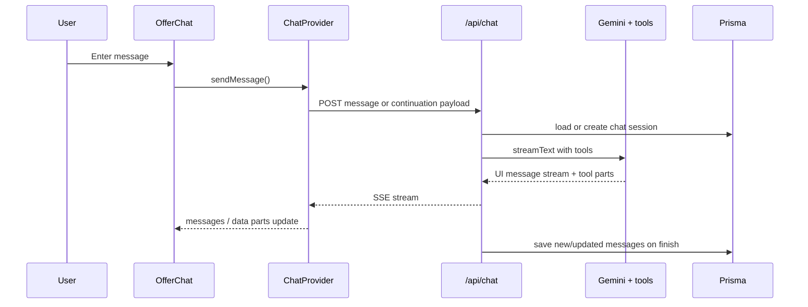

# Quote Offer Agent

This document describes the implementation of the quote/offer assistant as it exists today. It is based on the chat route, context provider, agent tools, and offer UI components.

## Overview

The Quote Offer Agent helps build a customer-facing offer from a lead record and any attached source files. It is used when a user wants to generate an offer letter / quotation for a lead and then review the offer, supporting files, and derived line items before saving the final quotation.

The workflow is designed for construction quoting and scope synthesis: the agent reads the lead, reads uploaded files, extracts structured cost data, and streams a customer-ready offer into the UI.

## Architecture

```mermaid
flowchart TD
  UI[Create Offer button] --> Modal[CreateOfferFileModal]
  Modal --> LeadSearch[useLeadSearch]
  Modal --> Upload[Blob upload /api/upload]
  Modal --> QuoteRoute[/quotations/:leadId]
  QuoteRoute --> OfferClient[OfferClient]
  OfferClient --> ChatProvider[ChatProvider]
  ChatProvider --> ChatAPI[/api/chat]
  ChatAPI --> Tools[AI tools]
  Tools --> Data[UI message stream]
  Data --> OfferChat[OfferChat]
  Data --> OfferFileCanvas[OfferFileCanvas]
  OfferFileCanvas --> createQuote[lib/data/quotes.ts]
```

### Components Involved

- [components/quotes/create-offer-modal.tsx](../components/quotes/create-offer-modal.tsx): lead picker and optional file upload gate before entering the quote workflow.
- [components/offer/offer-client.tsx](../components/offer/offer-client.tsx): layout wrapper that injects `ChatProvider` and splits the view into chat and offer canvas.
- [components/offer/offer-chat.tsx](../components/offer/offer-chat.tsx): renders the live assistant conversation and tool outputs.
- [components/offer/offer-file.tsx](../components/offer/offer-file.tsx): preview canvas, files table, line-items table, download/save actions.
- [components/offer/file-template.tsx](../components/offer/file-template.tsx): iframe-based HTML rendering for the customer-facing offer sheet.
- [components/chat/response.tsx](../components/chat/response.tsx): markdown/stream renderer used by the chat transcript.
- [components/chat/tool-result.tsx](../components/chat/tool-result.tsx): tool-output renderer for streamed agent parts.

### Context Provider

The offer flow is powered by [context/ChatContext.tsx](../context/ChatContext.tsx).

It owns:

- the AI chat session transport
- message state
- line-item state
- offer-file state
- auto-resume support for interrupted streams

### API Route

[app/api/chat/route.ts](../app/api/chat/route.ts) is the agent entrypoint.

It:

- checks Clerk auth
- resolves the database user from the Clerk id
- creates or loads the chat session for the lead
- converts persisted chat messages into UI messages
- streams the model response through the AI SDK
- saves completed messages back to the database

### Services And Utilities

The chat route imports and uses:

- [lib/data/chat.ts](../lib/data/chat.ts): chat session and message persistence
- [lib/data/user.ts](../lib/data/user.ts): Clerk-to-database user lookup
- [lib/tools/fetch-lead-info.ts](../lib/tools/fetch-lead-info.ts): lead and file lookup tools
- [lib/tools/file-tools.ts](../lib/tools/file-tools.ts): file-processing tool
- [lib/tools/line-item.ts](../lib/tools/line-item.ts): line-item generation tool
- [lib/tools/offer-file.ts](../lib/tools/offer-file.ts): offer-file generation tool
- [utils/chat.ts](../utils/chat.ts): conversion between DB messages and UI messages
- [utils/chat-error.ts](../utils/chat-error.ts): structured error responses for the chat route

## Tool Execution Flow

1. The user sends a message from the offer chat UI.
2. `ChatProvider` decides whether to send only the latest user message or the full message list for tool-approval continuations.
3. The request hits `/api/chat`.
4. The route loads the chat session and builds the UI message list.
5. The AI SDK streams a response from Gemini with tool access.
6. Tool parts are written into the UI message stream.
7. The client updates line-item and offer-file state from the streamed data parts.
8. The finished messages are persisted to the database.



## Agent Capabilities

Verified capabilities in the current code:

- lead lookup and lead detail retrieval
- lead file lookup
- file OCR / file processing through the Mistral OCR helper
- line-item generation with GST and totals
- offer-file generation with line items, subtotal, GST, and grand total
- chat-session continuation and resume

The system is wired for offer generation and pricing assistance. The current implementation does not expose separate planning or recommendation-specific tools beyond the data returned by the existing tools.

## Tooling

### Available Tools

- `fetchLeadInfoTool`
- `fetchLeadFilesTool`
- `FileProcessingTool`
- `lineItemTool`
- `offerFileTool`

### Inputs And Outputs

#### `fetchLeadInfoTool`

- Input: `leadId: number`
- Output: `{ success, message, data }`

#### `fetchLeadFilesTool`

- Input: `leadId: number`
- Output: `{ success, message, files, count }`

#### `FileProcessingTool`

- Input: `fileUrl: string`
- Output: `{ success, message, data }`

#### `lineItemTool`

- Input: line item fields such as `id`, `item`, `description`, `unitPrice`, `quantity`, `unit`, optional `gstRate`, `gstIncluded`, and `source`
- Output: `{ message, description, data }` plus a streamed `data-line-item-update`

#### `offerFileTool`

- Input: offer sections plus `lineItems` and optional `internalMarkupPercent`
- Output: `{ message, description, customerOffer, internal }` plus a streamed `data-offer-file-update`

### Execution Details

- `lineItemTool` and `offerFileTool` both write customer-facing data into the UI stream.
- `offerFileTool` also returns a private `internal` summary that is not written to the UI stream.
- `FileProcessingTool` runs OCR and returns a structured result object with `success`, `message`, and `data`.
- `fetchLeadFilesTool` returns a consistent structured response even when no files are found.

## Types

Core chat types live in [types/chat.ts](../types/chat.ts).

- `ChatMessageAI` is the AI SDK UI message type used across the chat flow.
- `LineItem` and `OfferFile` are the client-side shapes stored in `ChatContext`.
- `ChatTools` defines the tool set that can appear in the stream.
- `OfferFileToolOutput`, `LineItemToolOutput`, `FetchLeadInfoToolOutput`, `FetchLeadFilesToolOutput`, and `FileProcessingToolOutput` type the tool outputs used by the renderer.

The chat route accepts a request body shaped as:

- `leadId: number`
- `message?: UIMessage`
- `messages?: ChatMessageAI[]`

## User Flow

1. The user clicks the quotation action and opens the offer modal.
2. The user selects a lead and optionally uploads supporting files.
3. The modal navigates to the quotation route for that lead.
4. `OfferClient` mounts `ChatProvider` with the lead id and initial messages.
5. The user sends a prompt in `OfferChat`.
6. `/api/chat` streams the model response and tool parts.
7. `ChatContext` updates the offer file and line items from data parts.
8. `OfferFileCanvas` shows the preview, line items, and attached files.
9. The user can save the quotation through `createQuote()`.

## Limitations

- `fetchLeadFilesTool` is available to the model, but the UI renderer treats it as a generic tool output rather than a specialized card.
- `offerFileTool` assumes a 10% internal markup default unless a different value is passed.
- `OfferFileCanvas` currently uses a fixed 18% GST calculation when saving a quote.
- `handleDownload` in `OfferFileCanvas` is present but does not yet implement a download action.
- The chat route persists finished messages after streaming, but there is no separate agent state machine beyond the AI SDK stream and the local UI state.

## Extension Guide

### Add A New Tool

1. Create the tool in `lib/tools/`.
2. Export the tool type from `types/chat.ts` if the UI needs to render it strongly typed.
3. Register the tool in the `tools` map inside [app/api/chat/route.ts](../app/api/chat/route.ts).
4. Add a renderer branch in [components/chat/tool-result.tsx](../components/chat/tool-result.tsx) if the UI should show a custom card.
5. Update the system prompt if the tool changes the quoting rules.

### Add A New Capability

1. Decide whether the capability belongs in the chat route, a reusable server helper, or a dedicated tool.
2. Keep customer-facing data in the UI stream and private bookkeeping out of it.
3. Reuse existing validators or add a new Zod schema.
4. Keep output shapes serializable.

### Add A New Agent Action

1. Add the action to the tools map.
2. Teach the prompt how and when to use it.
3. Add UI handling for the resulting data part if the action produces a new stream type.
4. Persist any database-backed outcome in a server helper rather than in the client.

### Extend The UI

1. Extend `ChatContext` if the action needs additional derived state.
2. Add or update the relevant offer-view tab in `OfferFileCanvas`.
3. Update `ToolResult` for a specialized presentation.
4. Keep the message list scrollable and the offer canvas separate.