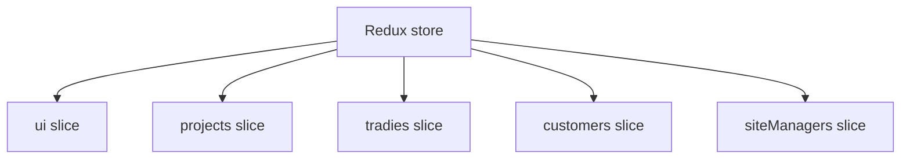

# State Management

This document defines the Redux architecture currently used in the repository and the standards that should govern new state code.

## Store Overview

The Redux store is configured in [lib/store/index.ts](../lib/store/index.ts) and exposed through [components/providers/redux-provider.tsx](../components/providers/redux-provider.tsx).

Current slices:

- `ui`
- `projects`
- `tradies`
- `customers`
- `siteManagers`



The store currently disables `serializableCheck`. That makes some flows easier, but it also lowers the guardrails that would normally catch accidental non-serializable values.

## What Belongs In Redux

Redux should hold shared coordination state, not the database.

Good candidates:

- modal state
- filters and sort state
- selected rows or active entities used by multiple child components
- optimistic overlays
- pagination state for reusable lookup lists
- async status and error messages that must be visible across sibling components

Poor candidates:

- one-off input field state that is only used inside a single form
- raw Prisma models that never leave one component tree
- derived values that can be recomputed cheaply on render
- long-lived server cache that is better handled by Next cache tags or the database

## Slice Structure Convention

The current slice pattern is fairly consistent:

- a typed initial state
- local reducers for UI and selection updates
- `createAsyncThunk` for network calls
- `extraReducers` for pending, fulfilled, and rejected handling

That is the right baseline.

### Common slice fields

The slices usually track:

- `items` or domain collections
- `loading` and `loadingMore`
- `error`
- pagination counters
- filter state

The project slice adds more domain-specific structures such as `mutations`, `optimisticUpdates`, upload state, and per-project detail UI state.

## Slice By Slice

### `ui`

[lib/store/slices/uiSlice.ts](../lib/store/slices/uiSlice.ts) owns application-wide modal and filter state.

It currently manages:

- the active modal type and payload
- project filters and view mode
- tradie filters

This is global coordination state and fits Redux well.

### `projects`

[lib/store/slices/projectsSlice.ts](../lib/store/slices/projectsSlice.ts) is the most complex slice.

It stores:

- the current project list
- the active project detail payload
- optimistic per-project overlays
- project mutation status
- upload queue state per project
- per-project detail tab state

Important behavior:

- create, variation, and update mutations return a full `ProjectDetail`
- `syncProjectState` updates both the list and the active detail entity
- uploads are tracked by project id and file id until completion or failure

This is a sensible pattern because project views are deeply nested and need a shared source of truth.

### `tradies`

[lib/store/slices/tradiesSlice.ts](../lib/store/slices/tradiesSlice.ts) coordinates the tradie dashboard.

It stores:

- tradie list data
- schedule rows
- filters and pagination
- summary, tab counts, and dashboard charts
- selection state
- pending schedule ids
- replacement flags
- a query-keyed dashboard cache
- project lookup data for modals

This slice is doing a lot. It is still coherent, but it is the clearest candidate for future decomposition if the feature grows further.

### `customers` and `siteManagers`

These slices are nearly identical lookup stores.

They both:

- fetch paginated searchable lookup rows
- append later pages with de-duplication
- track loading, loadingMore, and error

This duplication is acceptable for the current size, but it is not a long-term pattern to copy.

## Async Thunk Patterns

The repository uses `createAsyncThunk` for the following reasons:

- consistent pending/fulfilled/rejected lifecycle handling
- typed payloads and rejection values
- simple integration with route handlers

Current conventions:

- thunk names are namespaced by feature, such as `projects/createProject`
- thunks call route handlers rather than Prisma directly
- mutation thunks generally return the updated canonical entity

That last point is important. It lets reducers replace local slices with the server result instead of trying to reconstruct nested state by hand.

## Action Naming Conventions

Action naming is currently imperative and feature-focused.

Examples:

- `setProjects`
- `setActiveProject`
- `syncProjectFromDetail`
- `setTradieFilters`
- `toggleScheduleSelection`
- `openModal`

For new code, use the pattern:

- `setX` for direct assignment
- `clearX` for resets
- `toggleX` for booleans or id membership
- `syncXFromServer` for server-derived canonical refreshes

## Normalization Strategy

The current codebase does not use `createEntityAdapter` or a normalized entity store.

Instead, it keeps arrays in slice state and updates them manually.

This is acceptable for the current size, but it has tradeoffs:

- manual de-duplication is repeated in multiple slices
- list/detail synchronization is hand-rolled
- selectors become more expensive if collections grow large

If the data volume increases, normalization should be introduced feature by feature, not all at once.

## Loading And Error Handling Conventions

The current conventions are:

- `loading` means the main request is in flight
- `loadingMore` means pagination is fetching another page
- `error` holds a human-readable string or `null`
- mutation states often use `idle`, `pending`, `succeeded`, `failed`

That shape is visible most clearly in the projects slice.

## Optimistic Updates

The project module uses partial optimistic overlays in `optimisticUpdates`.

That is a practical compromise:

- it keeps the source data intact
- it avoids complex patching logic for nested fields
- it can be cleared when the server returns the canonical project payload

This should only be used where the UI benefits from immediate feedback. It should not become a default state pattern.

## Derived State Strategy

The repository currently prefers computed selectors and `useMemo` over storing derived data where possible.

Examples:

- project progress is computed from milestone status counts
- tradie cache keys are derived from filters and pagination state
- visible project rows overlay optimistic values onto the canonical list at render time

This is the correct direction. Store the minimum state needed to describe the UI, and derive the rest.

## Selectors And Memoization

The codebase uses `createSelector` only lightly today. Most derived access happens through hooks in components.

That is fine at the current scale, but the following rule should be used going forward:

- if a derived value is read in more than one component, move it into a memoized selector
- if a derived value is only used once, compute it locally

## Cache Invalidation And Synchronization

There are three cache layers in play:

- Next cache tags and `unstable_cache` in `lib/data`
- Redux slice state
- local component state

Synchronization is handled by the server returning refreshed entity payloads after mutations, plus manual `revalidateTag` calls.

For projects, that is currently the cleanest flow. For tradies, the slice also keeps a local query cache with a TTL.

## Server/Client State Boundaries

The intended boundary is:

- server owns persistence and canonical query shape
- Redux owns interaction state and cross-component coordination
- React local state owns transient UI state

Security note: do not store or rely on client-provided identity or authorization flags in Redux as a trust boundary. Validate any client-provided ids, role hints, or status changes on the server before applying them to canonical state.

The project list page currently blurs that boundary because it fetches server data in a component effect rather than a thunk. That should be standardized.

## Cross-Feature Communication

Cross-feature communication is handled almost entirely through `ui.modal` and shared Redux state.

This works for the current app because many actions happen from a central modal manager:

- project updates
- variation creation
- tradie scheduling
- reminder sending
- schedule status changes

If future features need looser coupling, prefer explicit events through slices or route-driven state over direct component-to-component references.

## Pagination And Infinite Loading

Lookup slices use the same pattern:

- page 1 replaces the collection
- later pages append
- duplicates are filtered out by id
- `loadingMore` is used for incremental fetches

This pattern is present in customers, site managers, and project lookup data.

## Standard Slice Template

Use this as the baseline for future slices:

```ts
type SliceState = {
  items: Item[];
  loading: boolean;
  loadingMore: boolean;
  error: string | null;
  page: number;
  limit: number;
  totalCount: number;
  totalPages: number;
};

const initialState: SliceState = {
  items: [],
  loading: false,
  loadingMore: false,
  error: null,
  page: 1,
  limit: 10,
  totalCount: 0,
  totalPages: 0,
};
```

Then add:

- a fetch thunk
- pending/fulfilled/rejected handlers
- clear or reset reducers
- optional selection or optimistic state only if the feature needs it

## Common Mistakes In The Current Codebase

- mixing direct component fetches with thunk-owned fetches in the same domain
- duplicating lookup pagination logic
- keeping feature cache logic in Redux without a clear invalidation story
- disabling serializability checks globally
- storing too many unrelated concerns in one slice when the feature starts to grow

## Recommended Cleanup Strategy

1. Standardize async fetching in Redux where the feature already has a slice.
2. Replace repeated lookup slice code with a shared helper or shared slice factory pattern.
3. Revisit `serializableCheck: false` and narrow it if possible.
4. Move server-derived data refreshes to canonical route responses instead of local patching.
5. Add selectors before state starts being consumed in multiple places.
